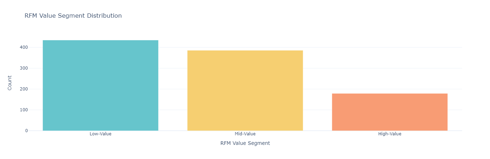
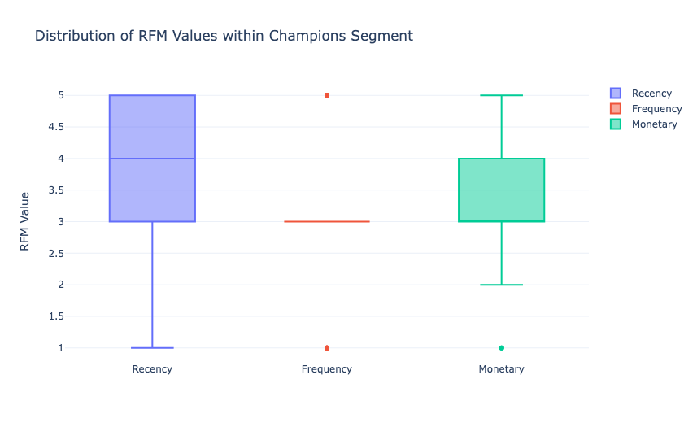

# An RFM Analytics dashboard:
- An analytics dashboard is a data visualization tool that aggregates, displays, and analyzes key performance indicators (KPIs), metrics, and other key data points related to a business, department, or specific process.
- To build an analytics dashboard using Python, we can use the plotly dash framework. Dash is a productive Python framework for building web analytical applications. It’s built on top of Plotly.js and React.js.
- It offers a simple interface for creating interactive, web-based dashboards. It is highly customizable and can produce very sophisticated and interactive dashboards. Dash applications are web servers running Flask and communicating JSON packets over HTTP requests.

## Overview
RFM Analysis is a concept used by Data Science professionals, especially in the marketing domain for understanding and segmenting customers based on their buying behaviour.
Using RFM Analysis, a business can assess customers’:
- Recency (the date they made their last purchase)
- Frequency (how often they make purchases)
- Monetary value (the amount spent on purchases)

## RFM analysis: 
- RFM stands for recency, frequency, and monetary value, which are three key metrics that provide information about customer engagement, loyalty, and value to a business.
- RFM Analysis is used to understand and segment customers based on their buying behaviour.
- Recency, Frequency, and Monetary value of a customer are three key metrics that provide information about customer engagement, loyalty, and value to a business.
- To perform RFM analysis using Python, we need a dataset that includes customer IDs, purchase dates, and transaction amounts. With this information, we can calculate RFM values for each customer and analyze their patterns and behaviours. 

### 1. Dataset:
- Dataset using here is from 'Statso'.
- Statso is a Data Science Community to Find Case Studies, Datasets and more!

### 2. Import required libraries
- Load the dataset as well.
- Convert 'PurchaseDate' to datetime

### 3. Calculating RFM scores
- Define scoring criteria for each RFM value
- Recency score: Higher score for lower recency (more recent)
- Frequency score: Higher score for higher frequency
- Monetary score: Higher score for higher monetary value
- Calculate RFM scores

### 4. Define scoring criteria for each RFM value
- Convert RFM scores to numeric type

### 5. RFM Value Segmentation
- Calculate RFM score by combining the individual scores
- Create RFM segments based on the RFM score

### 6. RFM Segment Distribution
- Create the bar chart
- Define the pastel color palette
- Create the bar chart with pastel colors
- Update the layout
- Show the image

### 6. RFM Customer Segments
- Create a new column for RFM Customer Segments
- Assign RFM segments based on the RFM score
- Print the updated data with RFM segments

### 7. RFM Analysis
- Analyze the distribution of customers across different RFM customer segments within each value segment
- Show the image
.png)

Now let’s analyze the distribution of RFM values within the Champions segment:  
- Filter the data to include only the customers in the Champions segment
- fig.add_trace
- fig.update_layout
- Show the image

Now let’s analyze the correlation of the recency, frequency, and monetary scores within the champions segment:
- Visualize the correlation matrix using a heatmap
- Show the image

### 7. Create a bar chart to compare segment counts
- Set the color of the Champions segment as a different color
- Update the layout
- Show the figure

### 8. Calculate the average Recency, Frequency, and Monetary scores for each segment
- Create a grouped bar chart to compare segment scores
- Add bars for Recency score
- Add bars for Frequency score
- Add bars for Monetary score
- Update the layout
- Show the figure
