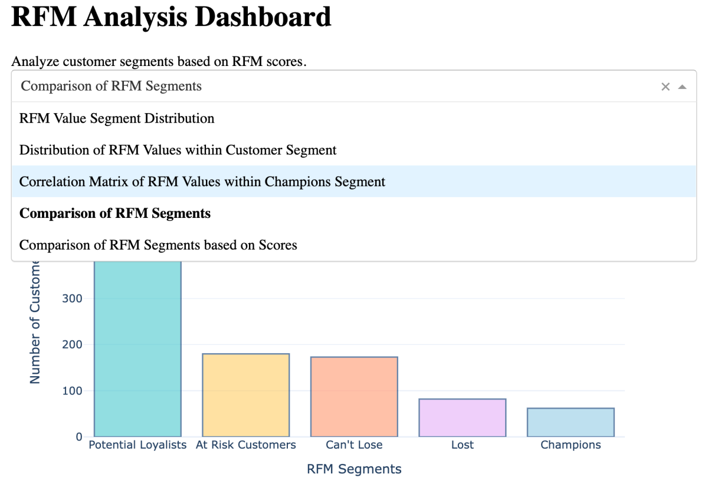

# An RFM Analytics dashboard:
- An analytics dashboard is a data visualization tool that aggregates, displays, and analyzes key performance indicators (KPIs), metrics, and other key data points related to a business, department, or specific process.
- To build an analytics dashboard using Python, we can use the plotly dash framework. Dash is a productive Python framework for building web analytical applications. It’s built on top of Plotly.js and React.js.
- It offers a simple interface for creating interactive, web-based dashboards. It is highly customizable and can produce very sophisticated and interactive dashboards. Dash applications are web servers running Flask and communicating JSON packets over HTTP requests.

## Overview
RFM Analysis is a concept used by Data Science professionals, especially in the marketing domain for understanding and segmenting customers based on their buying behaviour.
Using RFM Analysis, a business can assess customers’:
- Recency (the date they made their last purchase)
- Frequency (how often they make purchases)
- Monetary value (the amount spent on purchases)

## RFM analysis: 
- RFM stands for recency, frequency, and monetary value, which are three key metrics that provide information about customer engagement, loyalty, and value to a business.
- RFM Analysis is used to understand and segment customers based on their buying behaviour.
- Recency, Frequency, and Monetary value of a customer are three key metrics that provide information about customer engagement, loyalty, and value to a business.
- To perform RFM analysis using Python, we need a dataset that includes customer IDs, purchase dates, and transaction amounts. With this information, we can calculate RFM values for each customer and analyze their patterns and behaviours.
- To perform RFM analysis using Python, we need a dataset that includes customer IDs, purchase dates, and transaction amounts. With this information, we can calculate RFM values for each customer and analyze their patterns and behaviours.

### 1. Dataset:
- Dataset using here is from 'Statso'.
- Statso is a Data Science Community to Find Case Studies, Datasets and more!

### 2. Import required libraries
- Load the dataset as well.
- Convert 'PurchaseDate' to datetime

### 3. Calculating RFM scores
- Define scoring criteria for each RFM value
- Recency score: Higher score for lower recency (more recent)
- Frequency score: Higher score for higher frequency
- Monetary score: Higher score for higher monetary value
- Calculate RFM scores: We assigned scores from 5 to 1 to calculate the recency score, where a higher score indicates a more recent purchase. It means that customers who have purchased more recently will receive higher recency scores. We assigned scores from 1 to 5 to calculate the frequency score, where a higher score indicates a higher purchase frequency. Customers who made more frequent purchases will receive higher frequency scores. To calculate the monetary score, we assigned scores from 1 to 5, where a higher score indicates a higher amount spent by the customer. To calculate RFM scores, we used the pd.cut() function to divide recency, frequency, and monetary values into bins. We define 5 bins for each value and assign the corresponding scores to each bin.

### 4. Define scoring criteria for each RFM value
- Convert RFM scores to numeric type: Once the scores are added to the data, you will notice that they are categorical variables. You can use the data.info() method to confirm this. So we need to convert their datatype into integers to use these scores further: To calculate the RFM score, we add the scores obtained for recency, frequency and monetary value. For example, if a customer has a recency score of 3, a frequency score of 4, and a monetary score of 5, their RFM score will be 12.
Create RFM segments based on the RFM score: After calculating the RFM scores, we created RFM segments based on the scores. We divided RFM scores into three segments, namely "Low-Value", "Mid-Value", and "High-Value". Segmentation is done using the pd.qcut() function, which evenly distributes scores between segments.

### 5. RFM Value Segmentation
- Calculate RFM score by combining the individual scores
- Create RFM segments based on the RFM score

### 6. RFM Segment Distribution
- Create the bar chart
- Define the pastel color palette
- Create the bar chart with pastel colors
- Update the layout
- Show the image

### 7. RFM Customer Segments
The above segments that we calculated are RFM value segments. Now we'll calculate RFM customer segments. The RFM value segment represents the categorization of customers based on their RFM scores into groups such as "low value", "medium value", and "high value". These segments are determined by dividing RFM scores into distinct ranges or groups, allowing for a more granular analysis of overall customer RFM characteristics. The RFM value segment helps us understand the relative value of customers in terms of recency, frequency, and monetary aspects.
Now let's create and analyze RFM Customer Segments that are broader classifications based on the RFM scores. These segments, such as "Champions", "Potential Loyalists", and "Can't Lose" provide a more strategic perspective on customer behaviour and characteristics in terms of recency, frequency, and monetary aspects. Here's how to create the RFM customer segments:
- Create a new column for RFM Customer Segments
- Assign RFM segments based on the RFM score
- Print the updated data with RFM segments.
- We are assigning RFM segments to customers based on their RFM scores and then creating a new column called "RFM Customer Segments" in the data.

### 8. RFM Analysis
- Analyze the distribution of customers across different RFM customer segments within each value segment
- Show the image
.png)

Now let’s analyze the distribution of RFM values within the Champions segment:  
- Filter the data to include only the customers in the Champions segment
- fig.add_trace
- fig.update_layout
- Show the image
  

Now let’s analyze the correlation of the recency, frequency, and monetary scores within the champions segment:
- Visualize the correlation matrix using a heatmap
- Show the image
.png)

Now let’s have a look at the number of customers in all the segments:
- Create a bar chart to compare segment counts
- Set the color of the Champions segment as a different color
- Update the layout
- Show the figure
.png)

Now let’s have a look at the recency, frequency, and monetary scores of all the segments:
- Calculate the average Recency, Frequency, and Monetary scores for each segment
- Create a grouped bar chart to compare segment scores
- Add bars for Recency score
- Add bars for Frequency score
- Add bars for Monetary score
- Update the layout
- Show the figure
.png)

### 9. RFM Analysis into a dashboard:
- Import dash
- Initialize the Dash app
- Define the app layout using Bootstrap components
- Dropdown for selecting the chart
- Graph container
- Define callback to update the selected chart
- Return a default chart if no valid selection

### 10.  let’s understand each part of the above code.
- app = dash.Dash(__name__): This line initializes a new Dash application. __name__ helps determine the root path for the application.
- app.layout = html.Div([...]): It is a container that holds all other Dash and HTML components. It represents a division or a section in an HTML document. It is where you define the structure of your dashboard.

Inside the html.Div, the following components are included:
- html.H1(“RFM Analysis Dashboard”, className=”text-center mb-4″): This creates a header (H1 tag in HTML) for the title of the dashboard. className is used to apply CSS classes.
- html.Div(“Analyze customer segments based on RFM scores.”, className=”text-center mb-4″): This is a text description providing some context about the dashboard.
- dcc.Dropdown(…): This creates a dropdown menu that allows the user to select the type of chart they want to display. The options parameter is a list of dictionaries, each representing a different chart the user can select. value sets the default value displayed in the dropdown.
dcc.Graph(id=’rfm-chart’, className=”mb-4″): This is a container for the graph that will display the selected chart. The id is used to identify this component in callbacks.

### Note:
- @app.callback is a decorator that turns a Python function into a Dash callback. Whenever an input component’s property changes, the function it decorates gets called automatically. 

- Output(‘rfm-chart’, ‘figure’) indicates that the output of the callback will be to modify the ‘figure’ property of the component with the id ‘rfm chart’. Input(‘chart-type-dropdown’, ‘value’) specifies the input for the callback. It uses the ‘value’ property of the component with the id ‘chart-type-dropdown’. When this value changes (i.e., the user selects a different option from the dropdown), the callback function is triggered.

- def update_chart(selected_chart_type) is the callback function that gets called when the input changes. It receives the new value of the dropdown as an argument and returns the figure corresponding to the selected chart type
